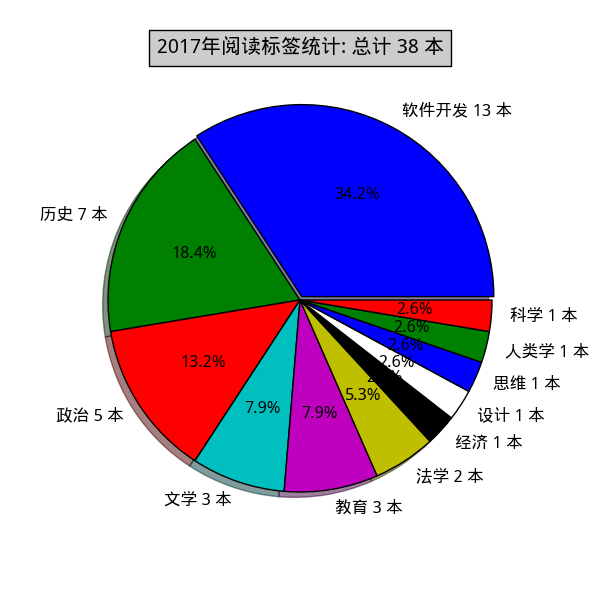

## 2017年阅读统计
## 总计阅读 27 本
### 评价统计:

 > 五星图书 11 本，占比 40.7%  
 > 四星图书 9 本，占比 33.3%  
 > 三星图书 6 本，占比 22.2%  
 > 两星图书 1 本，占比 3.7%  

### 标签统计:

 > 编程 12 本  
 > 政治 6 本  
 > 历史 3 本  
 > 经济 1 本  
 > 社会 1 本  
 > 科普 1 本  
 > 设计 1 本  
 > 英语 1 本  
 > 育儿 1 本  

### 编程: 12 本
#### No.1 C++ API设计
 > 图书名称：[C++ API设计](https://book.douban.com/subject/24869855/)  
 > 豆瓣链接：[https://book.douban.com/subject/24869855/](https://book.douban.com/subject/24869855/)  
 > 标签：编程        评分：五星  
 > 我的评论：C++API领域中的《代码大全》，非常适合框架、库的开发者。  

#### No.2 计算机程序的构造和解释
 > 图书名称：[计算机程序的构造和解释](https://book.douban.com/subject/1148282/)  
 > 豆瓣链接：[https://book.douban.com/subject/1148282/](https://book.douban.com/subject/1148282/)  
 > 标签：编程        评分：五星  
 > 我的评论：跳过语法、开发环境等杂碎，直接享受纯思维的乐趣，也只有scheme这么纯的语言能够做到：程序抽象、数据抽象、语言抽象、机器抽象，顺带介绍了lambda表达式、流、惰性求值、寄存器、垃圾回收、编译与解释等等概念。当作程序入门读难度有点大，也许<How to programs>更适合担当此任。从今而后，我要把程序员分为两种：一种读过SICP，另一种没读过SICP。  

#### No.3 深入理解C++11 : C++ 11新特性解析与应用
 > 图书名称：[深入理解C++11 : C++ 11新特性解析与应用](https://book.douban.com/subject/24738301/)  
 > 豆瓣链接：[https://book.douban.com/subject/24738301/](https://book.douban.com/subject/24738301/)  
 > 标签：编程        评分：五星  
 > 我的评论：讲C++11新出来的特性，对于已经熟悉C++的人来说，很合适，能够快速了解C++11有哪些新特性，讲的也非常好，简洁易懂，适度深入。  

#### No.4 Programming From The Ground Up
 > 图书名称：[Programming From The Ground Up](https://book.douban.com/subject/1787855/)  
 > 豆瓣链接：[https://book.douban.com/subject/1787855/](https://book.douban.com/subject/1787855/)  
 > 标签：编程        评分：五星  
 > 我的评论：简明易懂的AT&T汇编入门书籍，将各种程序概念讲的通俗易懂，最后的推荐书单非常经典。英语CET4水平即可读懂英文版，中文版为《深入理解程序设计》  

#### No.5 深入理解程序设计 : 使用Linux汇编语言
 > 图书名称：[深入理解程序设计 : 使用Linux汇编语言](https://book.douban.com/subject/25789594/)  
 > 豆瓣链接：[https://book.douban.com/subject/25789594/](https://book.douban.com/subject/25789594/)  
 > 标签：编程        评分：五星  
 > 我的评论：简明易懂的AT&T汇编入门书籍，将各种程序概念讲的通俗易懂，最后的推荐书单非常经典。英语CET4水平即可读懂英文版，中文版为《深入理解程序设计》  

#### No.6 UNIX环境高级编程 : 第2版
 > 图书名称：[UNIX环境高级编程 : 第2版](https://book.douban.com/subject/1788421/)  
 > 豆瓣链接：[https://book.douban.com/subject/1788421/](https://book.douban.com/subject/1788421/)  
 > 标签：编程        评分：五星  
 > 我的评论：条理清晰，钜细靡遗，非常基础的 unix/linux 编程入门书籍。  

#### No.7 图解TCP/IP : 第5版
 > 图书名称：[图解TCP/IP : 第5版](https://book.douban.com/subject/24737674/)  
 > 豆瓣链接：[https://book.douban.com/subject/24737674/](https://book.douban.com/subject/24737674/)  
 > 标签：编程        评分：四星  
 > 我的评论：通俗易懂，简单明了，网络入门必读，赞。  

#### No.8 七周七语言 : 理解多种编程范型
 > 图书名称：[七周七语言 : 理解多种编程范型](https://book.douban.com/subject/10555435/)  
 > 豆瓣链接：[https://book.douban.com/subject/10555435/](https://book.douban.com/subject/10555435/)  
 > 标签：编程        评分：四星  
 > 我的评论：如果只熟悉一两种语言的话，不妨看看这本书，开拓视野，了解不同编程范式。  

#### No.9 Android驱动开发与移植实战详解
 > 图书名称：[Android驱动开发与移植实战详解](https://book.douban.com/subject/11511562/)  
 > 豆瓣链接：[https://book.douban.com/subject/11511562/](https://book.douban.com/subject/11511562/)  
 > 标签：编程        评分：三星  
 > 我的评论：驱动开发入门  

#### No.10 Android底层开发技术实战详解——内核、移植和驱动
 > 图书名称：[Android底层开发技术实战详解——内核、移植和驱动](https://book.douban.com/subject/26345170/)  
 > 豆瓣链接：[https://book.douban.com/subject/26345170/](https://book.douban.com/subject/26345170/)  
 > 标签：编程        评分：三星  
 > 我的评论：第一版是《Android驱动开发与移植实战详解》？？为啥作者完全不同，而内容大部分相同呢？谁抄谁呢？？  

#### No.11 性能之巅 : 洞悉系统、企业与云计算
 > 图书名称：[性能之巅 : 洞悉系统、企业与云计算](https://book.douban.com/subject/26586598/)  
 > 豆瓣链接：[https://book.douban.com/subject/26586598/](https://book.douban.com/subject/26586598/)  
 > 标签：编程        评分：三星  
 > 我的评论：A dictionary book for performance.  

#### No.12 Android内核剖析
 > 图书名称：[Android内核剖析](https://book.douban.com/subject/6811238/)  
 > 豆瓣链接：[https://book.douban.com/subject/6811238/](https://book.douban.com/subject/6811238/)  
 > 标签：编程        评分：两星  
 > 我的评论：缺少架构图或流程图，关键节点不够突出，因此有点记流水帐或泛泛而谈的感觉。讲的和android内核关系不大，主要还是在framework层面。  

### 政治: 6 本
#### No.13 我也有一个梦想 : 近距离看美国之三
 > 图书名称：[我也有一个梦想 : 近距离看美国之三](https://book.douban.com/subject/1014825/)  
 > 豆瓣链接：[https://book.douban.com/subject/1014825/](https://book.douban.com/subject/1014825/)  
 > 标签：政治        评分：五星  
 > 我的评论：通过详细介绍民权法案产生、执行、深入民心的来龙去脉。非常精彩且富有思辨精神了介绍了美国种族融合过程，暂进式的社会与法制变革，体现了一个不断革新的民主社会如何通过一个个具体案件分析、反思、妥协，改进其社会制度。  

#### No.14 如彗星划过夜空 : 近距离看美国之四
 > 图书名称：[如彗星划过夜空 : 近距离看美国之四](https://book.douban.com/subject/1762869/)  
 > 豆瓣链接：[https://book.douban.com/subject/1762869/](https://book.douban.com/subject/1762869/)  
 > 标签：政治        评分：五星  
 > 我的评论：这本书通过制宪会议以及五角大楼文件案引发的对宪法第一修正案新闻自由原则的考验，概览了宪法诞生的环境、妥协、实践以及不断地完善。美国的幸运在于，他们在没有构建出庞大的政府以前，就已经有一批懂得分权与制衡的政治绅士以及宪法指导。宪法，政府，民众三者是在一个互相妥协的过程中慢慢长大。  

#### No.15 美国宪政历程 : 影响美国的25个司法大案
 > 图书名称：[美国宪政历程 : 影响美国的25个司法大案](https://book.douban.com/subject/1144185/)  
 > 豆瓣链接：[https://book.douban.com/subject/1144185/](https://book.douban.com/subject/1144185/)  
 > 标签：政治        评分：五星  
 > 我的评论：搭配林达的《近距离看美国》系列一起看，有对比、多角度看会更有趣。通俗易懂地通过一个个具体案件讲述美国人民怎样在分权与制衡理念下一步一步完善、更新他们的宪政观念与制度，尤其是在这个过程中最高法院如何一步一步建立和维护宪政的权威，当然也有错判与现实的妥协。民主可以说一种妥协制度。  

#### No.16 历史深处的忧虑 : 近距离看美国之一
 > 图书名称：[历史深处的忧虑 : 近距离看美国之一](https://book.douban.com/subject/1027191/)  
 > 豆瓣链接：[https://book.douban.com/subject/1027191/](https://book.douban.com/subject/1027191/)  
 > 标签：政治        评分：四星  
 > 我的评论：这一本主要介绍权利法案即宪法修正案条文、含义以及案例，重点介绍了辛普森案。行文有点冗长，不够简练，但对了解美国政体，民情基调还是非常有帮助的。  

#### No.17 总统是靠不住的 : 近距离看美国之二
 > 图书名称：[总统是靠不住的 : 近距离看美国之二](https://book.douban.com/subject/1056315/)  
 > 豆瓣链接：[https://book.douban.com/subject/1056315/](https://book.douban.com/subject/1056315/)  
 > 标签：政治        评分：四星  
 > 我的评论：用通俗易懂讲故事的形式，把美国政治体制中基于制约与均衡理念的三权分立讲述出来，非常适合入门了解美国政体、法制、选举等方面。尼克松水门事件分析得非常精彩。  

#### No.18 一路走来一路读
 > 图书名称：[一路走来一路读](https://book.douban.com/subject/1010888/)  
 > 豆瓣链接：[https://book.douban.com/subject/1010888/](https://book.douban.com/subject/1010888/)  
 > 标签：政治        评分：三星  
 > 我的评论：书中提到的大部分案例在《近距离看美国》系列中基本都提到过，这一本可算是那个系统的花絮和外传吧。书中介绍了独具一格的美国南方小镇的自治状态。  

### 历史: 3 本
#### No.19 中国法律与中国社会
 > 图书名称：[中国法律与中国社会](https://book.douban.com/subject/1224279/)  
 > 豆瓣链接：[https://book.douban.com/subject/1224279/](https://book.douban.com/subject/1224279/)  
 > 标签：历史        评分：四星  
 > 我的评论：单就学术著作可评五星。透过对纲常名教剖析可以看到赤裸裸的吃人真相。中国过去的法，甚至是至现在的法律现实，都是法表儒里-搞有差别化对待，什么刑不上大夫、党内处分，几千年有啥变化？  

#### No.20 开放中的变迁 : 再论中国社会超稳定结构
 > 图书名称：[开放中的变迁 : 再论中国社会超稳定结构](https://book.douban.com/subject/5906321/)  
 > 豆瓣链接：[https://book.douban.com/subject/5906321/](https://book.douban.com/subject/5906321/)  
 > 标签：历史        评分：四星  
 > 我的评论：用一个超稳定框架+意识形态的万能膏药来解释一切，不免有点武断和牵强，尤其是1924年之后的部分。我能说要集体文化来解释传统的一切，用个体文化来预示未来也可以么？总体来说，作者的一些观点与总结还是值得赞赏。  

#### No.21 明治维新的国度
 > 图书名称：[明治维新的国度](https://book.douban.com/subject/25962185/)  
 > 豆瓣链接：[https://book.douban.com/subject/25962185/](https://book.douban.com/subject/25962185/)  
 > 标签：历史        评分：三星  
 > 我的评论：广有余而深不足，内容较多前后重述，图多，搞得像游记类图书，贵在客观。对于不了解明治维新那一段变革，可以翻一翻。  

### 经济: 1 本
#### No.22 经济为什么会崩溃 : 鱼、美元和经济学
 > 图书名称：[经济为什么会崩溃 : 鱼、美元和经济学](https://book.douban.com/subject/6743298/)  
 > 豆瓣链接：[https://book.douban.com/subject/6743298/](https://book.douban.com/subject/6743298/)  
 > 标签：经济        评分：五星  
 > 我的评论：有趣有料，简明简短，正三观，经济学门外汉入门首选！  

### 社会: 1 本
#### No.23 优秀的绵羊
 > 图书名称：[优秀的绵羊](https://book.douban.com/subject/26747208/)  
 > 豆瓣链接：[https://book.douban.com/subject/26747208/](https://book.douban.com/subject/26747208/)  
 > 标签：社会        评分：四星  
 > 我的评论：在狭隘的精英教育下只顾成长的一代缺失了意义感、好奇心，这是社会阶层固化，各自只顾各自小圈子的必然现象。  

### 科普: 1 本
#### No.24 黑猩猩在召唤
 > 图书名称：[黑猩猩在召唤](https://book.douban.com/subject/1951398/)  
 > 豆瓣链接：[https://book.douban.com/subject/1951398/](https://book.douban.com/subject/1951398/)  
 > 标签：科普        评分：四星  
 > 我的评论：通过科学观察写成的有关黑猩猩的江湖，集科学性、故事性、启发性于一体，佩服作者的专注与热情。培养某个或某些兴趣是最好的成长。  

### 设计: 1 本
#### No.25 设计心理学
 > 图书名称：[设计心理学](https://book.douban.com/subject/4606471/)  
 > 豆瓣链接：[https://book.douban.com/subject/4606471/](https://book.douban.com/subject/4606471/)  
 > 标签：设计        评分：五星  
 > 我的评论：论可视性与反馈的重要性，非常经典的设计方面的书籍。  

### 英语: 1 本
#### No.26 把你的英语用起来！ : 原地复活你放下多年的英语
 > 图书名称：[把你的英语用起来！ : 原地复活你放下多年的英语](https://book.douban.com/subject/3748247/)  
 > 豆瓣链接：[https://book.douban.com/subject/3748247/](https://book.douban.com/subject/3748247/)  
 > 标签：英语        评分：三星  
 > 我的评论：路线图+资料汇总。作者主要推崇通过循序渐进地大量阅读与透析原著来提高英语水平。  

### 育儿: 1 本
#### No.27 游戏力 : 随时随地激活孩子天性中的合作与勇气
 > 图书名称：[游戏力 : 随时随地激活孩子天性中的合作与勇气](https://book.douban.com/subject/6084402/)  
 > 豆瓣链接：[https://book.douban.com/subject/6084402/](https://book.douban.com/subject/6084402/)  
 > 标签：育儿        评分：四星  
 > 我的评论：游戏是探索求知、亲情培养、社交情商、情绪调节多方面的灵丹妙药。洗澡的不听--玩水的乖乖来，这就是游戏力的魔力。  

